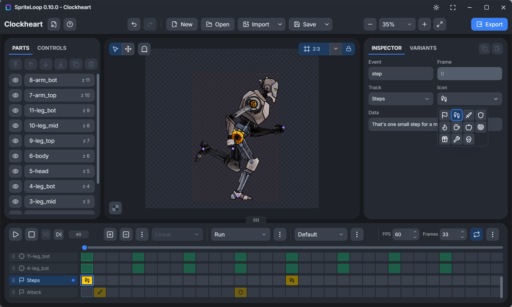

# SpriteLoop App

Public issue tracker for the SpriteLoop desktop app.

This repository does not contain application source code. It exists so users can
report bugs, request features, and attach screenshots or project details in one
public place.

  

## Report an Issue

Please open a GitHub issue and include:

- What you were trying to do.
- What happened instead.
- Your operating system.
- The SpriteLoop app version.
- Screenshots, exported files, or a small `.spriteloop` project if they help
  reproduce the problem.

For crashes or export problems, include the exact steps that trigger the issue
and any error text shown by the app.

## Related Projects

- SpriteLoop on itch.io: https://balkanramgames.itch.io/spriteloop
- SpriteLoop Defold extension: https://github.com/Balkan-Ram-Games/spriteloop-defold

## Screenshots

